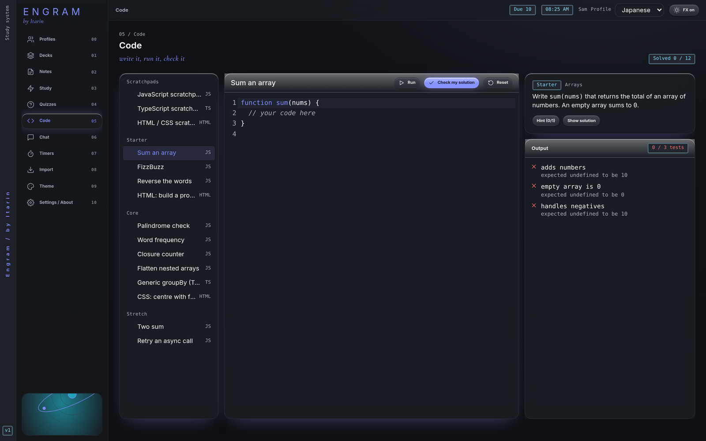

The **Code** section is a small practice editor. You can try out ideas in a scratchpad or work through built-in exercises that check your solution for you.

## Scratchpads

Three scratchpads are at the top of the list:

- **JavaScript scratchpad:** press **Run** (or <kbd>Ctrl</kbd> + <kbd>Enter</kbd>, <kbd>Cmd</kbd> + <kbd>Enter</kbd> on a Mac). Anything you `console.log` appears below the editor.
- **TypeScript scratchpad:** types are removed and the code runs as JavaScript. There's no type checking.
- **HTML / CSS scratchpad:** **Run** shows the page in a preview.

## Exercises

There are 12 exercises, grouped by difficulty:

- **Starter:** Sum an array, FizzBuzz, Reverse the words, HTML: build a profile card
- **Core:** Palindrome check, Word frequency, Closure counter, Flatten nested arrays, Generic groupBy (TypeScript), CSS: centre with flexbox
- **Stretch:** Two sum, Retry an async call

For each one:

1. Read the task on the right.
2. Write your solution in the editor.
3. Press **Check my solution**. Engram runs a set of tests and shows which pass.
4. Stuck? **Hint** reveals hints one at a time. **Show solution** shows a reference answer, and you can load it into the editor.

**Reset** puts the starter code back. The counter at the top shows how many exercises you've solved.

## Your progress is saved

Your code for each exercise and scratchpad is saved automatically in the current profile, so you can leave and come back later.

## Safety

Code runs in a locked-down sandbox inside Engram. It can't read your notes or files or reach the internet. If your code runs for too long (for example, an endless loop), Engram stops it after a few seconds and tells you.
