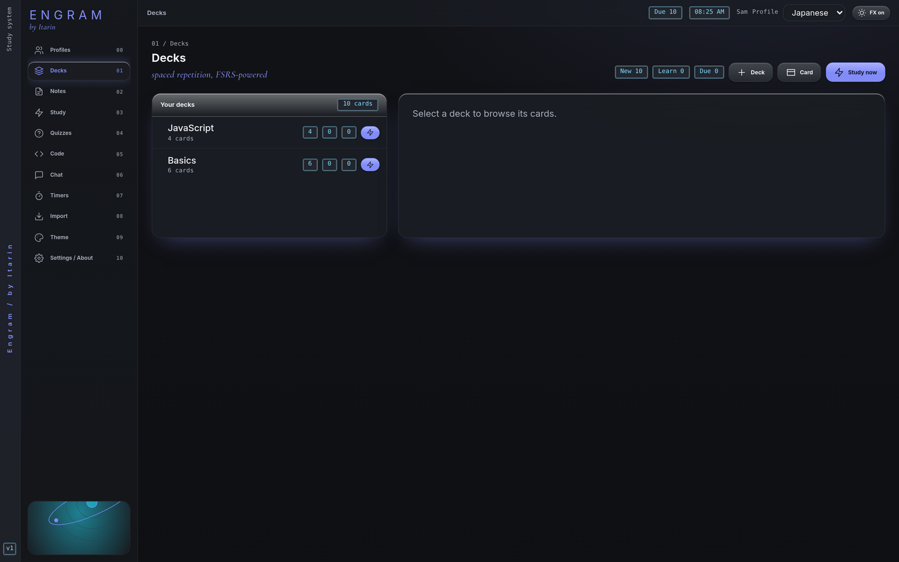
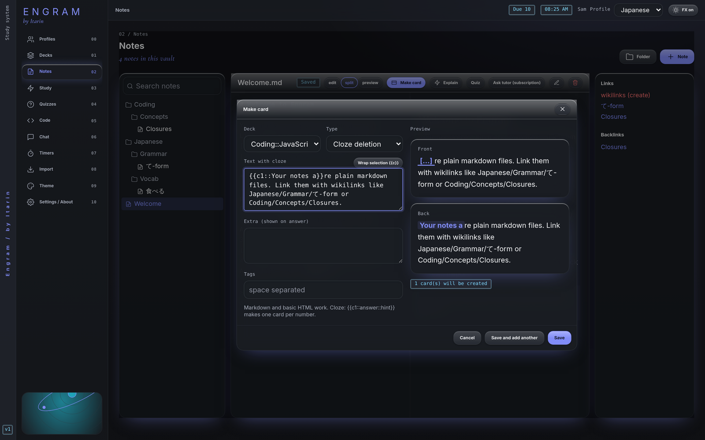

Flashcards live in decks. A card has a front (the question or prompt) and a back (the answer). Engram shows you each card again just before you're likely to forget it. That's [spaced repetition](/docs/features/study/).



## Decks

- Press **Deck** to create one.
- Put `::` in a name to nest decks, like `Japanese::N5 Vocab`, the same way Anki does. Studying a parent deck includes all of its sub-decks.
- Click a deck to see its cards, search them, rename the deck, delete it, or start a **Quiz** from it.
- The three numbers next to each deck are **new**, **learning** and **due** cards.

Deleting a deck deletes its cards and their review history, and can't be undone.

Each deck brings in up to **20 new cards a day**. Reviews of cards you've already started are never capped. The limit isn't adjustable in the app yet.

## Card types

| Type | What it makes |
| --- | --- |
| **Basic** | One card: front, then back. |
| **Basic + reversed** | Two cards: front to back, and back to front. Good for vocabulary. |
| **Cloze deletion** | Hides part of a sentence for you to recall. |

### Cloze cards

Wrap the part to hide in `{{c1::...}}`:

```
The {{c1::mitochondria}} is the {{c2::powerhouse}} of the cell.
```

Each number becomes its own card, so this example makes two. Add a hint after a second `::`, like `{{c1::mitochondria::organelle}}`. When writing a cloze card, select a word in the text box and press **Wrap selection** to wrap it for you.

Card text can use markdown and basic HTML. Tags are optional words separated by spaces.

## Make a card from a note

1. In [Notes](/docs/features/notes/), select the words you want to remember.
2. Press **Make card**, or <kbd>Ctrl</kbd> + <kbd>Shift</kbd> + <kbd>C</kbd> (<kbd>Cmd</kbd> + <kbd>Shift</kbd> + <kbd>C</kbd> on a Mac).
3. The selection becomes the front. Switch **Type** to **Cloze deletion** and Engram turns the whole sentence into a cloze card with your selection hidden.
4. Choose a deck (or **+ New deck...**) and press **Save**, or **Save and add another**.

Engram remembers the last deck you used. Cards made from a note keep a link to it, so while studying you can press **Source** to jump back to the note.



## Add a card by hand

Press **Card** on the Decks page. The editor is the same as above, with a live preview of both sides.

## Manage cards

In a deck's card list, each card shows its state (NEW, LEARN, REVIEW, RELEARN, or HOLD if suspended) and its next due date. The buttons on each card:

- **Edit** changes its text and tags.
- **Suspend** takes it out of study until you unsuspend it.
- **Reset progress** makes it a new card again.
- **Delete** removes it.

Other ways to get cards: [import from Anki or a spreadsheet](/docs/features/import/), save a missed quiz question as a card, or save a tutor reply as a card.
