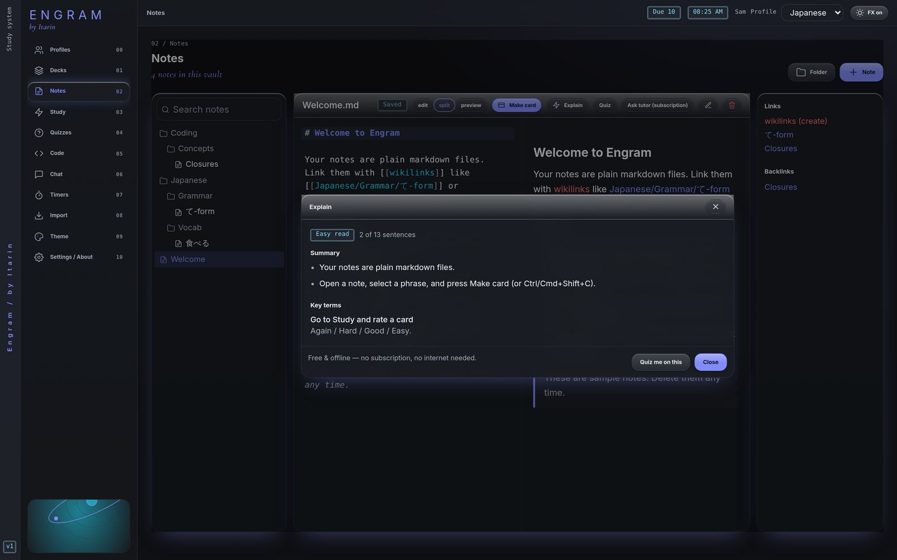

**Explain** gives you a quick, plainer look at a note. It's free, works offline, and needs no AI provider or subscription.

## Use it

Open a note in [Notes](/docs/features/notes/) and press **Explain**. A window shows:

- **Summary:** the note's most important sentences, in their original order. A few wordy phrases are swapped for plainer ones (for example "utilize" becomes "use").
- **Key terms:** terms and definitions found in the note, such as lines written as `Term: definition` or `- **Term:** definition`.
- **Reading level:** a rough badge (Easy, Medium or Dense) based on sentence and word length.

From the window, **Quiz me on this** makes a quiz from the same note.

## What it can and can't do

Explain picks out sentences you already wrote. It never invents new text, so it can't rephrase ideas or answer questions about them. For that, use the [AI tutor](/docs/features/tutor/).

It works best on notes written in full sentences. A note made only of headings, bullet fragments or code may not have enough text, and Engram will tell you so. Summaries of Japanese or other text without spaces between words are rougher than English ones, though key terms still work.
