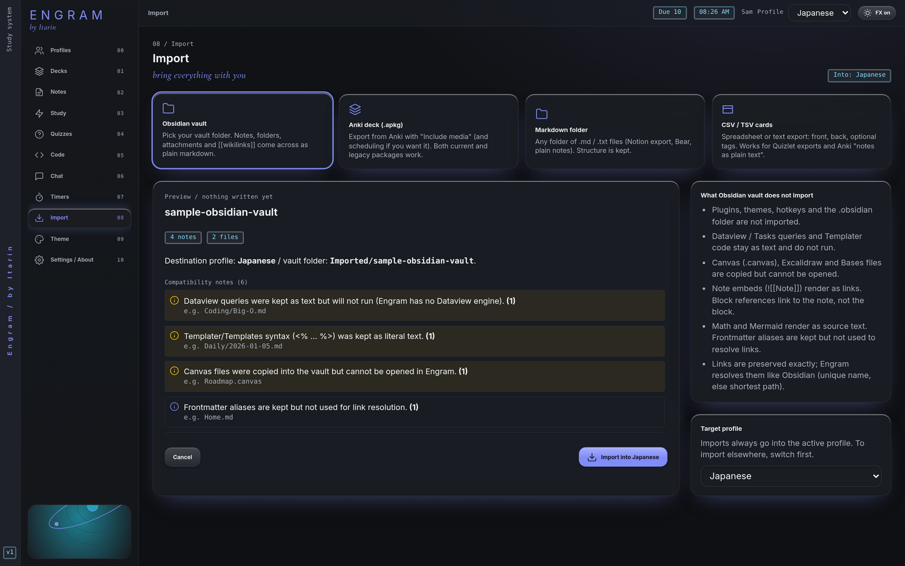

**Import** brings your existing notes and flashcards into Engram. You always see a preview first, and nothing is written until you confirm. Imports never overwrite files you already have.

## How importing works

1. Make sure the profile you want is active. Imports always go into the **active profile**.
2. Open **Import** and pick a source.
3. Choose the folder or file.
4. Read the preview. It shows what will be added, name clashes, duplicates, and anything that won't carry over.
5. Adjust the options if needed, then press **Import into** your profile.

If the preview finds cards you already have, you're asked to tick a confirmation box before importing.

## Sources

### Obsidian vault

Pick your vault folder. Notes, folders, frontmatter, tags, `[[links]]` and image embeds come across. Links are kept exactly as written and resolved the way Obsidian does.

Not carried over: plugins, themes, hotkeys and the `.obsidian` folder. Dataview and Tasks queries and Templater code stay as plain text. Canvas, Excalidraw and Bases files are copied but can't be opened in Engram. Maths and Mermaid diagrams show as source text.

> You don't have to import a vault to use it. When you create a profile you can point it at an existing vault folder and use it in place.

### Anki deck (.apkg)

Pick an `.apkg` export (a single-collection `.colpkg` also works). Decks, sub-decks, basic, reversed and cloze cards, tags and the media your cards use all come across, from both older and current Anki versions.

- **Keep scheduling** (on by default) converts your Anki review progress so cards stay roughly where they were. Untick it to start every card as new. The conversion is approximate, so your first few reviews may be timed a little differently than in Anki.
- **Deck prefix** puts the imported decks under a parent deck, like `Imported`.
- Card templates are turned into finished cards once, at import time.
- Media goes into an `_anki-media` folder in your vault.
- Re-importing the same deck skips cards you already have and never overwrites them.

Not supported: Anki add-ons, card styling (CSS), scripts, type-in answers, image occlusion and custom scheduling options.

### Markdown folder

Any folder of `.md`, `.markdown` or `.txt` files, plus common images, audio, video and PDFs. Use this for notes exported from other apps. Links are kept as they are. Hidden folders (like `.git`) are skipped.

### CSV / TSV cards

A spreadsheet of cards, one per row, saved as `.csv`, `.tsv` or `.txt`.

- Column 1 is the front, column 2 the back, column 3 the tags, unless a header row names the columns (`front`, `back`, `tags`, `deck`).
- A front containing `{{c1::...}}` becomes a cloze card.
- Choose the **Deck name** (it defaults to the file name) and whether to detect cloze cards automatically or make every row a basic card.
- Every row imports as a new card. No review progress is carried over.
- From Quizlet: export with "Between term and definition" set to **Tab**, then import the `.txt` file here.

## Where imported notes go

For vaults and markdown folders, choose the **Notes destination**: the top of your vault, or an `Imported/<name>` subfolder. By default, Engram uses the top level if your vault is empty and a subfolder if it isn't.

If a file with the same name already exists, choose **Keep both** (the incoming file is renamed) or **Skip incoming**. Existing files are never overwritten.
