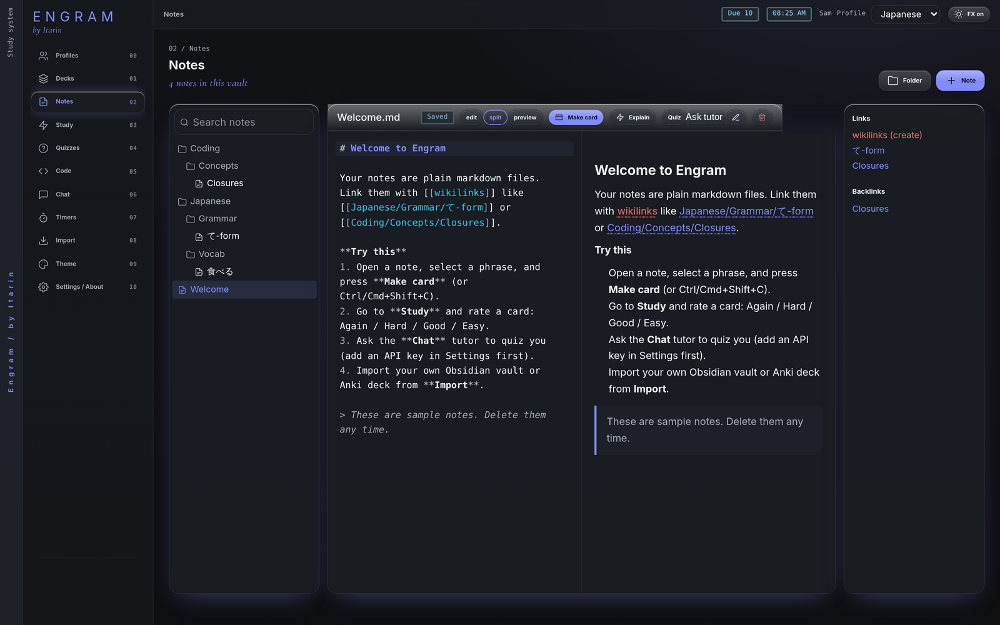

Notes are where you write down what you're learning. Every note is a plain markdown (`.md`) file in your profile's folder, so you can also open them in any text editor, or in Obsidian.

## The Notes screen

- **Left:** your folders and notes, plus a search box. Search looks at note names and their text once you type two or more characters.
- **Middle:** the open note. Switch between **edit**, **split** (editor and preview side by side) and **preview**.
- **Right** (on wide windows): the note's outgoing **Links** and its **Backlinks**, meaning other notes that link to this one.

Notes save automatically as you type. The small label next to the title shows **Saving**, then **Saved**.

## Create a note

Press **Note**, type a title, and pick a template and a folder. Folders are created for you if they don't exist.

| Template | Starts in |
| --- | --- |
| Blank note | the vault's top level |
| Daily study log | `Daily` |
| JP vocab entry | `Japanese/Vocab` |
| JP grammar point | `Japanese/Grammar` |
| JP kanji | `Japanese/Kanji` |
| Coding concept | `Coding/Concepts` |
| Code snippet | `Coding/Snippets` |
| Bug journal | `Coding/Bugs` |
| Lecture / reading notes | `School` |

Press **Folder** to create an empty folder. You can type a path with slashes, like `Japanese/Grammar`.

## Link notes together

Type two square brackets and a note name, like `[[Particles]]`. As you type, Engram suggests note names. In the preview, links are clickable.

- A link to a note that doesn't exist yet shows in red. Click it and Engram creates that note for you, in the same folder as the one you're in.
- You can link to a heading (`[[Particles#は]]`) or show different text (`[[Particles|particle notes]]`), the same way Obsidian does.

## Rename, move and delete

- The pencil button renames or moves a note. Type a new path, like `Japanese/Grammar/Particles.md`. Leave **Update [[links]] in other notes** ticked and Engram rewrites links in your other notes to match.
- The bin button deletes the note file. Cards you made from it keep working.

## Buttons on every note

- **Make card:** turns the text you've selected into a flashcard. See [Decks and cards](/docs/features/decks-and-cards/#make-a-card-from-a-note).
- **Explain:** a free, offline summary of the note. See [Explain](/docs/features/explain/).
- **Quiz:** makes a quiz from this note. See [Quizzes](/docs/features/quizzes/).
- **Ask tutor:** opens the tutor chat with this note (and any selected text) attached. Free, no subscription. See [AI tutor](/docs/features/tutor/).

## Markdown basics

Notes use standard markdown: `#` for headings, `**bold**`, `*italic*`, `-` for lists, and backticks for `code`. Images in your vault can be shown with Obsidian-style embeds like `![[diagram.png]]`. Embedding another note (`![[Other note]]`) shows a link to it rather than its contents.
