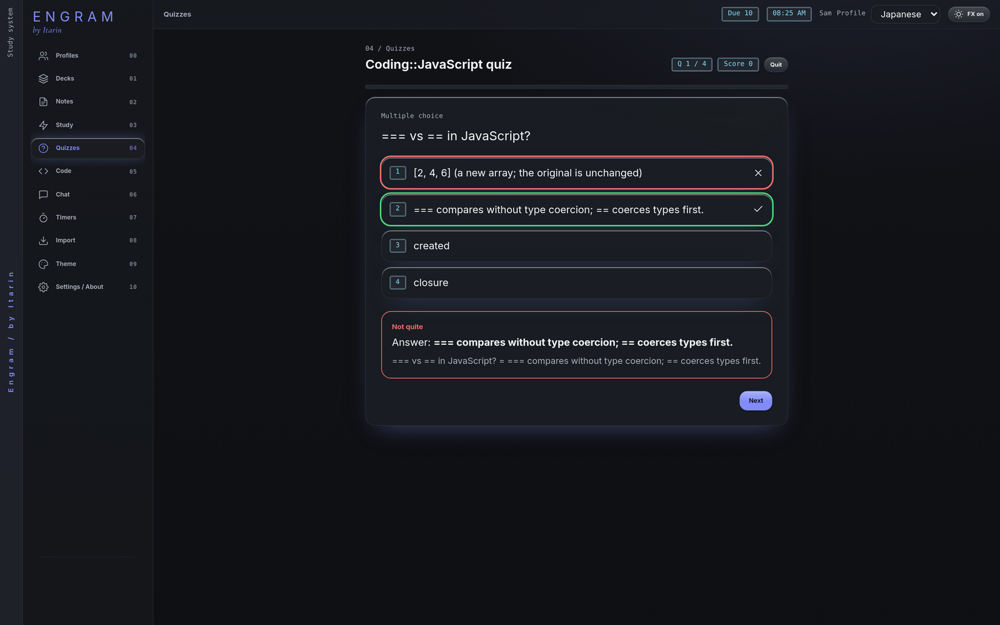

Quizzes test you on material in a different way from flashcards. Engram builds them for you from a deck, a note, or text you paste in.

## Make a quiz

1. Open **Quizzes**. (Or press **Quiz** on a note or a deck.)
2. Choose the source: **deck**, **note**, or **Paste**.
3. Pick how many questions (5, 10, 15 or 20) and the type: **Mixed**, **Multiple choice** or **Short answer**.
4. Pick a **Generator**:
   - **Built-in (offline, from your cards/notes)** works with no internet and no AI. It finds facts in your material, such as card fronts and backs, `Term: definition` lines, bold terms and cloze cards, and turns them into questions.
   - **Tutor model (needs API key)** asks the AI provider you set up to write the questions. This is free in Engram, but it does need a provider set up in **Settings, Tutor & API key**. See [AI tutor](/docs/features/tutor/#connect-an-ai-provider).
5. Press **Generate quiz**.

The built-in generator needs enough material: at least 3 usable cards in a deck, or a note or text with at least 3 facts it can find. Pasted text needs at least a few sentences.

## Taking a quiz

- **Multiple choice:** click an answer or press <kbd>1</kbd> to <kbd>6</kbd>, then **Check** (or <kbd>Enter</kbd>).
- **Short answer:** type your answer and press <kbd>Enter</kbd>. Engram accepts small typos and answers that are close. If it marks you wrong but you were right, press **I was right**.
- After checking, <kbd>Enter</kbd> or <kbd>Space</kbd> moves to the next question.
- **Quit** leaves the quiz at any point.

## Results

At the end you see your score and every question with your answer and the correct one. From here you can:

- **Retake** the same quiz.
- Press **Card** on a missed question to save it as a flashcard (tagged `quiz-miss`).
- **Ask tutor about missed** sends the questions you missed to the tutor chat (free, no subscription).

Past quizzes are listed on the Quizzes page with your best score and number of attempts. Press **Take** to try one again, or the bin to delete it.
