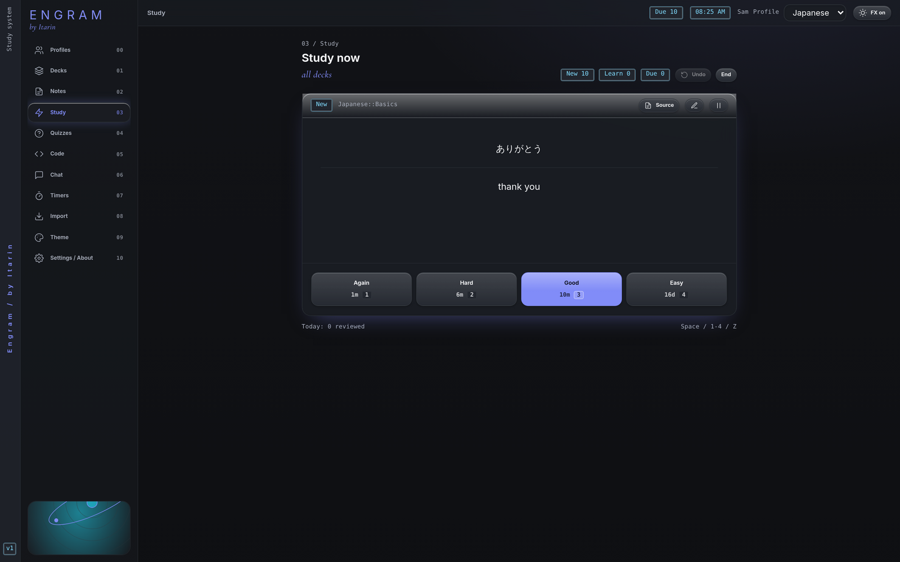

**Study** shows you the cards that are due, one at a time. After each card you say how well you remembered it, and Engram picks the next date to show it again. Cards you know well come back less and less often. Cards you struggle with come back sooner.

## Start a session

1. Open **Study**.
2. Pick a deck, or **All decks**. The counters show how many cards are new, learning and due.
3. Press **Study now**.

You can also press the lightning button next to any deck on the Decks page, or the **Due** counter in the top bar.

## Rating a card

Look at the front and try to remember the answer, then press **Show answer**. Rate yourself honestly:

| Button | Means | Key |
| --- | --- | --- |
| **Again** | I forgot it. | <kbd>1</kbd> |
| **Hard** | I got it, but it was a struggle. | <kbd>2</kbd> |
| **Good** | I remembered it. | <kbd>3</kbd> or <kbd>Space</kbd> |
| **Easy** | Instant, no effort. | <kbd>4</kbd> |

Each button shows when the card would come back if you pick it, for example `10m` or `16d`.

<kbd>Space</kbd> (or <kbd>Enter</kbd>) shows the answer, and pressing it again rates the card **Good**. Press <kbd>Z</kbd>, or the **Undo** button, to undo your last rating.

## While studying

- **Source** opens the note a card was made from.
- The pencil button edits the card without leaving the session.
- The pause button suspends the card, taking it out of study until you unsuspend it in Decks.
- **End** stops the session. Nothing is lost if you stop halfway.

When nothing else is due you'll see **All caught up**, with how many cards you reviewed today and what share you remembered.

## How the schedule works

Engram uses FSRS, a modern scheduling method that estimates how likely you are to remember each card and aims to show it when that chance drops to about 90%.

- **New cards** go through two short learning steps (1 minute, then 10 minutes) before they graduate to longer gaps.
- **Forgotten cards** (you pressed Again) come back after 10 minutes, then rejoin the normal schedule.
- **Order:** learning cards that are due come first, then due reviews, then new cards (up to 20 new per deck per day). If a learning card is due within the next 20 minutes and nothing else is left, Engram shows it a little early.

You don't need to understand any of this to use Study. Just rate honestly and come back each day.
