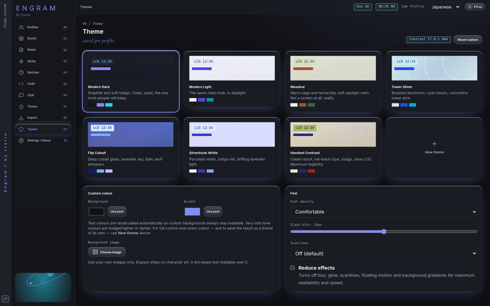
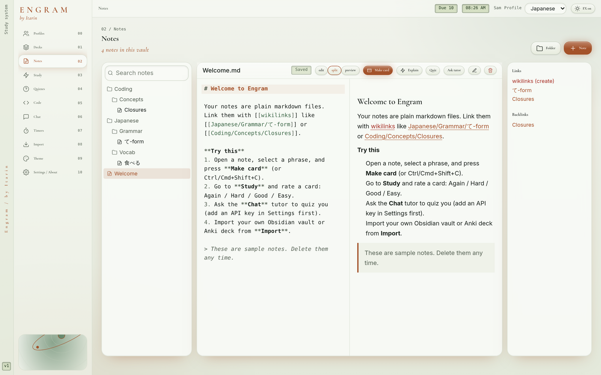
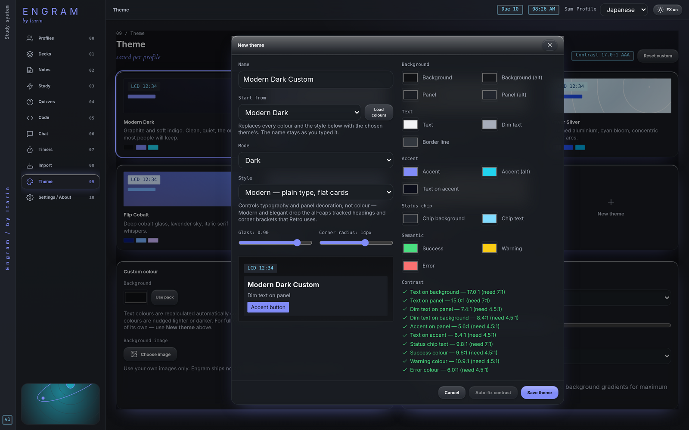

Engram can look clean and modern, or like a piece of early-2000s tech. Everything is in **Theme**, and each profile remembers its own look.

## Theme packs

- **Modern:** Modern Dark (the default), Modern Light and Meadow. Plain, contemporary styling.
- **Retro:** Tower Silver, Flip Cobalt, Silverbook White and Handset Contrast. An original Y2K look, with different lettering, panel textures and corner details, not just different colours.

Click a pack to switch to it right away.

<figure>

<figcaption>The same screen in Meadow.</figcaption>
</figure>

## Adjust the current theme

- **Custom colour:** change the **Background** and **Accent** colours. Engram adjusts the text colours automatically so they stay readable, and shows the contrast ratio.
- **Background image:** use your own picture (up to 2 MB). Engram adds a tint over it so text stays readable.
- **Font density:** compact, comfortable or spacious.
- **Glass blur:** how frosted the panels look.
- **Scanlines:** an optional retro screen effect, off by default.
- **Reduce effects:** turns off blur, glow, scanlines, floating motion and background gradients. This is also in the top bar (**FX on / FX off**) and in Settings.

If your computer is set to reduce motion, Engram turns on Reduce effects for you when you first set it up.

## Build your own theme

1. Press **New theme**.
2. Give it a name and pick a theme to **Start from**.
3. Choose light or dark **Mode**, a **Style** (Modern, Elegant or Retro, which controls lettering and panel decoration) and set glass and corner radius.
4. Change any colour.
5. Watch the **Contrast** checklist. Every check has to pass before you can save. **Auto-fix contrast** adjusts any failing colour until it passes.
6. Save. Your theme appears with the built-in packs.

You can edit or delete your own themes at any time. Custom themes belong to the profile you made them in.

## Accessibility

Every built-in pack meets WCAG AA contrast, and custom themes are held to the same rules. Every control can be reached with the keyboard and shows a visible focus ring.
