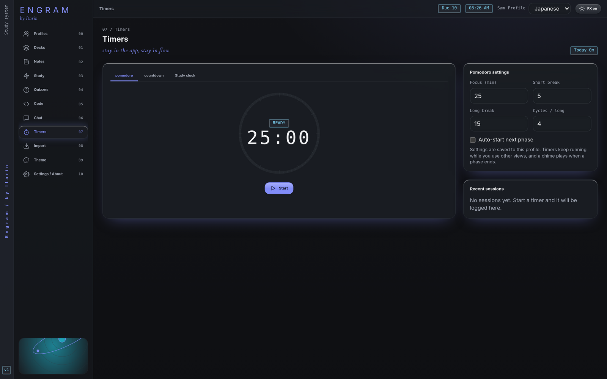

**Timers** helps you study in focused blocks and keeps a log of your sessions.

## Three kinds of timer

- **Pomodoro:** focus for a set time, then take a short break. After a few focus blocks, take a long break. The defaults are 25 minutes focus, 5 minutes short break, 15 minutes long break, and a long break every 4 cycles.
- **Countdown:** pick 10, 15, 30, 45, 60 or 90 minutes, or type any time up to 600 minutes.
- **Study clock:** counts up from zero until you press **Finish**.

For countdowns and the study clock you can add a label, like "Kanji review". It shows in your session history.

## Controls

- **Start**, **Pause** and **Resume**.
- **Skip phase** (Pomodoro) jumps to the next focus or break.
- **Stop** (or **Finish**) ends the timer and saves the session.
- **Discard** ends it without saving.

A chime plays when a phase ends. The first time you start a timer, Engram may ask to show notifications, so you get an alert even when the window isn't in front.

Timers keep running while you use other parts of Engram. The time left shows in the top bar and in the window title. Click it to come back to Timers.

## Pomodoro settings

Change the focus, short break and long break lengths, and how many cycles come before a long break. Tick **Auto-start next phase** to go straight from focus to break and back without pressing Start. Settings are saved in the current profile, and can't be changed while a timer is running.

## Session history

**Recent sessions** lists your last sessions with their length. The **Today** counter at the top adds up today's focus, countdown and study clock time (breaks aren't counted). Sessions shorter than 5 seconds aren't saved.

If you switch profiles while a timer is running, it's stopped and saved to the profile it started in.
