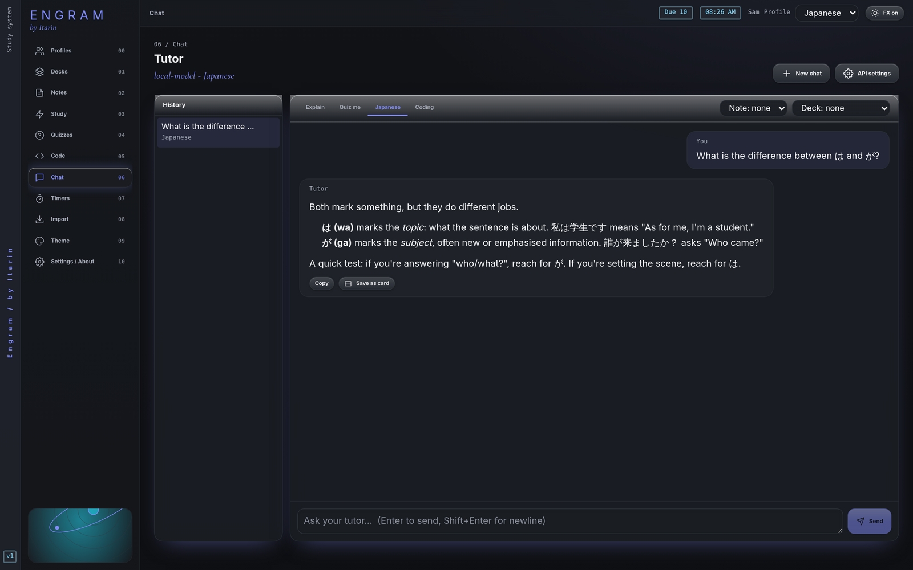
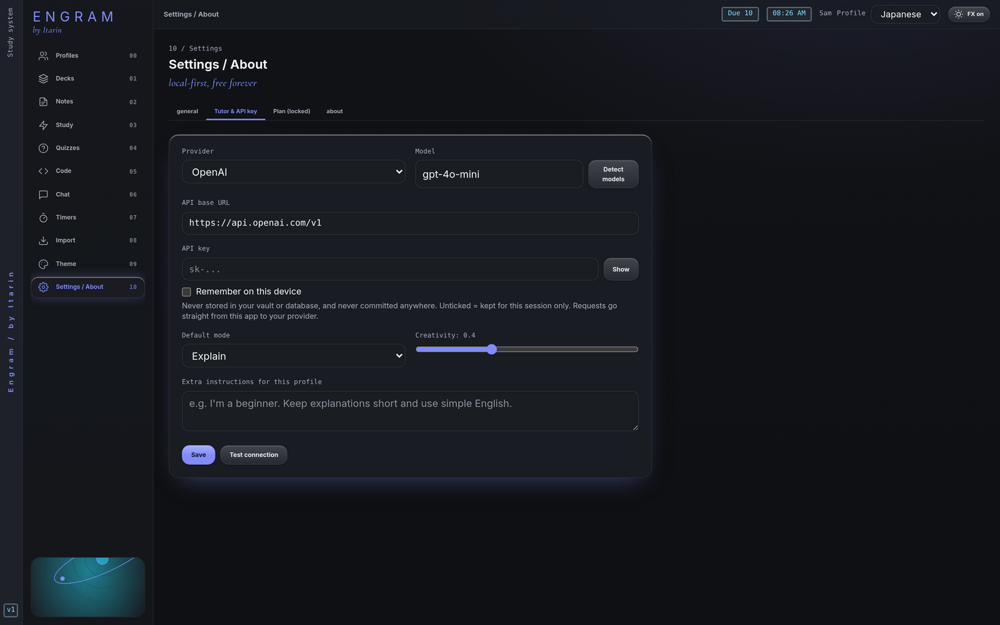

The tutor is a chat assistant that can read the note, selection or deck you give it. It can explain ideas, quiz you, help with a language, or talk through code.

The screenshot shows a real Engram chat screen. The reply comes from a test model, not a real AI service.

## What you need

The tutor needs two separate things:

1. **The tutor add-on.** The chat screen is Engram's one paid feature: **$5 a month, with the first month free**. You can cancel any time.
2. **An AI provider.** Engram doesn't include an AI model. You connect one yourself, either an online service with an API key (such as OpenAI or OpenRouter, which charge you for usage) or a free model running on your own computer (LM Studio or Ollama, no key needed).

Everything else in Engram is free and works without either one. That includes AI-written quizzes, which only need the provider.

## Connect an AI provider

1. Open **Settings**, then **Tutor & API key**. (Once the tutor is unlocked, **API settings** in Chat opens the same form.)
2. Choose a **Provider**: OpenAI, OpenRouter, Ollama (local), LM Studio (local), or Custom OpenAI-compatible. This fills in the address and a suggested model.
3. Check the **Model** name. For local servers, press **Detect models** to pick from what's installed.
4. Paste your **API key** if your provider needs one.
5. Press **Save**, then **Test connection**.

Optional settings, saved per profile: the **Default mode**, **Creativity** (how varied answers are), and **Extra instructions** (for example "I'm a beginner. Keep explanations short.").

### Using LM Studio or Ollama

- **LM Studio:** open its Developer tab, load a model and start the server. Then choose **LM Studio (local)** in Engram and press **Detect models**.
- **Ollama:** make sure Ollama is running and you've downloaded a model. Choose **Ollama (local)** and check the model name matches.

Local models run entirely on your computer and don't need an internet connection.

### Where your API key is kept

- By default the key is kept only until you close Engram.
- Tick **Remember on this device** to keep it between launches. It's then saved in Engram's app storage on this computer, **in plain text**, so only do this on a computer you trust.
- The key is never written to your notes folder or database, and it's only ever sent to the provider you chose.

## Subscribe

1. Open **Chat** (or **Settings, Plan**).
2. Enter your email and press **Send code**. Engram emails you a one-time code, which expires after 10 minutes.
3. Enter the code and press **Verify**.
4. Press **Start free month**. Stripe's secure checkout opens in your web browser.
5. Finish checkout, then come back to Engram. It checks automatically. You can also press **I've paid, check now**.

Your email is only used to match your subscription to your computer. It isn't a study profile and has nothing to do with your notes.

### Manage or cancel

**Manage subscription** (in Chat or **Settings, Plan**) opens Stripe's customer portal in your browser, where you can update your card or cancel. If you cancel, the tutor stays unlocked until the end of the period you've paid for.

### Offline

Engram re-checks your subscription in the background about every 12 hours while it's open. If it can't reach the subscription server (for example, you're offline), the tutor keeps working for up to 4 days since the last successful check, then locks until Engram can check again.

## Chatting

- Pick a **mode** along the top: **Explain**, **Quiz me**, **Japanese** or **Coding**. Each one sets how the tutor behaves. The Japanese mode works well for other languages too.
- Attach context with the **Note** and **Deck** menus. When you press **Ask tutor** on a note, that note (and any text you selected) is attached for you.
- Press <kbd>Enter</kbd> to send, <kbd>Shift</kbd> + <kbd>Enter</kbd> for a new line. **Stop** cuts a reply short.
- Under each reply: **Copy**, or **Save as card** to turn your question and the answer into a flashcard.
- Your past chats are listed on the left (on wide windows). Press **New chat** to start fresh.

The tutor only replies in the chat. It never changes your notes or cards by itself.

## What gets sent, and where

When you send a message, Engram sends it straight from your computer to the AI provider you configured, together with the attached note, selection or deck (up to 40 cards) and your recent messages in that chat. Nothing passes through Engram's own servers. The provider's own privacy policy covers what happens next. See the [privacy policy](/privacy/) for the full picture.
