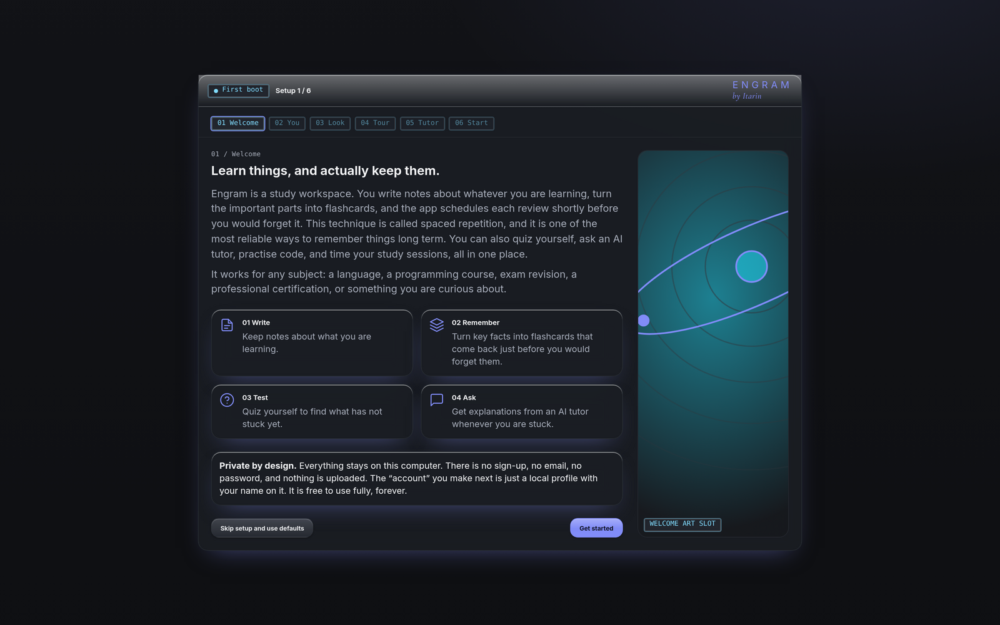
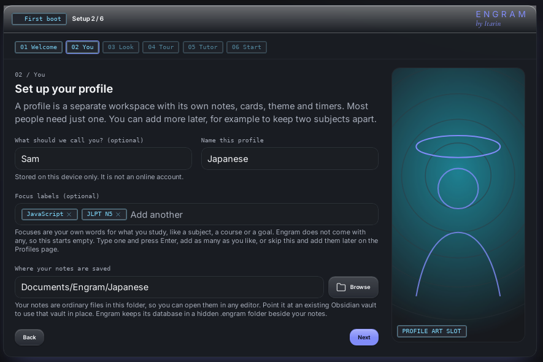
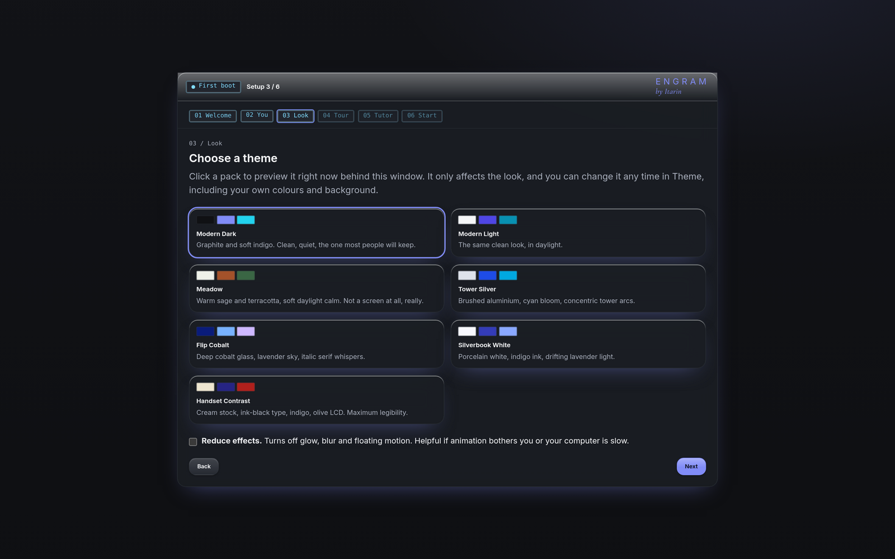
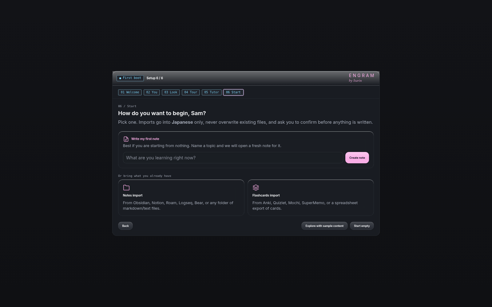

The first time you open Engram, a short splash screen appears (click or press any key to skip it), followed by a six-step setup. It assumes you've never used a study app before. You can go back to any earlier step with **Back** or the numbered steps along the top.

## Skip it if you like

On the first screen, **Skip setup and use defaults** creates an empty profile called "My Study" with the default look and takes you straight into the app. You can change everything later.

## The six steps

### 1. Welcome

A plain explanation of what Engram does: write notes, turn the important parts into flashcards, review them on a schedule, quiz yourself, and ask the optional AI tutor.

### 2. You

- **What should we call you?** Optional. It's only used to greet you, and it's stored on this computer. It is not an online account.
- **Name this profile.** Required. A profile is a separate workspace with its own notes, cards, theme and timers. Most people need just one. See [Profiles](/docs/getting-started/profiles/).
- **Focus labels.** Optional words of your own, like a subject or a course. Type one and press <kbd>Enter</kbd>. Engram doesn't come with any, and they don't change how anything works.
- **Where your notes are saved.** Engram suggests `Documents/Engram/<profile name>`. Use **Browse** to choose a different folder, or pick an existing Obsidian vault to use it in place. Your notes are ordinary files in this folder. See [Your data](/docs/reference/your-data/).

### 3. Look

Pick a theme pack. Clicking a pack previews it straight away behind the setup window. You can also turn on **Reduce effects** here, which switches off glow, blur and motion. Everything on this step can be changed later in [Themes](/docs/features/themes/).

### 4. Tour

A map of every section in the sidebar and a three-step example of how a note becomes a flashcard.

### 5. Tutor (optional)

Explains the AI tutor, what it needs and where your data goes, and lets you connect an AI provider now. The tutor chat itself is free, no subscription. You can press **Skip for now** and set it up any time. See [AI tutor](/docs/features/tutor/).

### 6. Start

Choose how to begin:

- **Write my first note:** type a topic and Engram opens a new note for it.
- **Obsidian vault**, **Anki deck** or **Spreadsheet or markdown:** jumps to [Import](/docs/features/import/) with that source selected.
- **Explore with sample content:** adds a few example notes and two small decks (Japanese and JavaScript) so you can try everything. Delete them whenever you like.
- **Start empty:** nothing is added.

## After setup

The sidebar on the left (a menu button on narrow windows) takes you to every section. Press <kbd>Ctrl</kbd> + <kbd>1</kbd> to <kbd>9</kbd> (<kbd>Cmd</kbd> on a Mac) to jump between the first nine sections. The bar across the top shows how many cards are due, the time, and which profile you're in.

Next: learn how [Notes](/docs/features/notes/) work, or go straight to [Decks and cards](/docs/features/decks-and-cards/).
