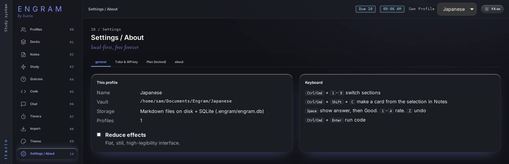

Open **Settings / About** from the bottom of the sidebar. It has four tabs.

## General

- **This profile:** the profile's name, where its notes are saved (its vault), how its data is stored, and how many profiles you have.
- **Reduce effects:** a flat, still, high-legibility look. See [Themes](/docs/features/themes/#adjust-the-current-theme).
- **Keyboard:** a quick list of [keyboard shortcuts](/docs/reference/keyboard-shortcuts/).

## Tutor & API key

Connects the AI provider used by the free tutor chat and by AI-written quizzes: provider, model, API address, API key, default mode, creativity and extra instructions. See [AI tutor](/docs/features/tutor/#connect-an-ai-provider).

## Backup

One-slot cloud backup: **Back up now** / **Restore from backup**, plus signing in with your email, starting the free month, checking your status, or opening **Manage subscription**. **Use a different email** signs this computer out. See [Cloud backup](/docs/features/cloud-backup/).

## About

What Engram is, and an honest list of its limits, such as what each importer can't bring across.

## Settings that live elsewhere

| Setting | Where |
| --- | --- |
| Theme, colours, background, density, effects | **Theme** |
| Profile names, labels, art, vault folders | **Profiles** |
| Pomodoro lengths and auto-start | **Timers** |
| Import options | **Import**, each time you import |

Theme, tutor defaults and timer settings are saved per profile. Your API key and tutor sign-in apply to the whole computer.
